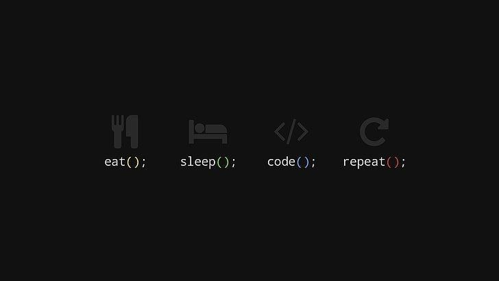

  
<h1 align="center" style="color:red;"><b>Hi there, I'm Yash 👋</b></h1>

## 💫 About Me

I'm a **Software Engineer** passionate about building scalable systems. I love solving problems and making technology more efficient.

- 🌱 Currently learning **Nx** and **Neo4J DB**.
- 💬 Ask me anything tech-related.
- ⚡ Fun fact: I enjoy working on **open-source projects** and automating workflows.

## 🚀 Technologies I Work With:
- **Backend:** Node.js, Express, GraphQL  
- **Database:** PostgreSQL, MongoDB, GraphDB  
- **DevOps:** AWS, Docker, GCP, Pulumi  
- **Tools:** VS Code, Git, Postman  

## 📊 GitHub Stats:

## 📂 Featured Projects:
- **[School Management System](https://github.com/yashrsb/School-Management-System):** A backend project providing a centralized platform for school administrators to manage their institutions efficiently.  
- **[Countries World](https://github.com/yashrsb/countries_world):** Displays information about different countries, including name, capital, currency, weather, and exchange rates.  

## 🌟 Connect with Me:

- 💼 [LinkedIn](https://www.linkedin.com/in/yash-raj-singh-b-2b229a198/)
- 📧 [Email Me](mailto:yrajsingh0001@gmail.com)

## 💡 Quote of the Day:

## 💰 Support Me
